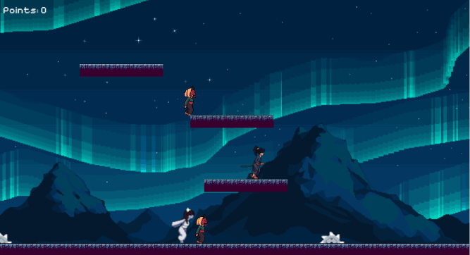
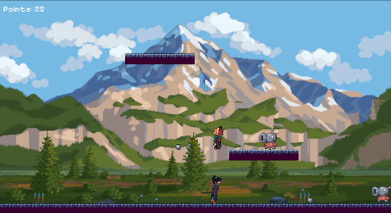
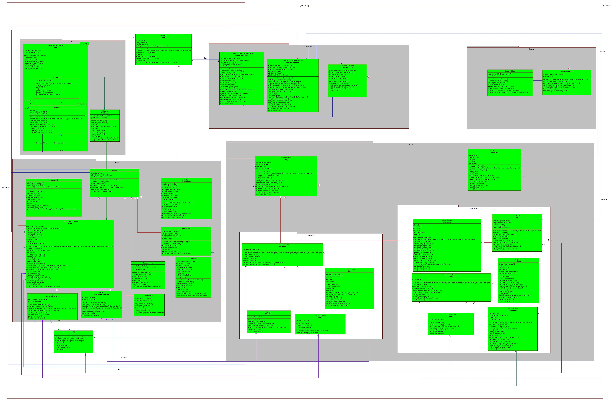

# RegularGame++

RegularGame++ is a **2D action-platformer** developed using **C++** and **SFML Graphics Library** with procedurally generated levels, ensuring every playthrough is unique. The game combines precise movement, dynamic combat, and unpredictable obstacles. Players control a character who can walk, jump, and attack, facing varied enemies.

## 🎮 Gameplay

- **Single or Multiplayer**: Play solo or with your friend simultaneously.
 
- **Menus**: In the main and the pause menu, you can save, view a leaderboard and choose between single and multiplayer.

- **Unique Enemies**: Fight youkais, ghosts and cannonheads with different behaviours.

- **Different stages**: Face 2 stages that are different every run, with exclusive enemies and obstacles.

## ⚙️ Configurations Used

OS: Ubuntu 24.04

Compiler: g++ 13.3.0

Graphics Library: SFML 2.5.1

Cmake: 4.0.3

## 🛠️ General Structure

The game follow the principles of **Oriented-Object Progamming**, uses **UML diagrams** to guide the implementation and applies **desing patterns** such as singleton and iterator. 

### Main Packages and Classes

- **Game**: Game is the central class that runs the main loop.

- **Ent**: Ent is the base abstract class for all entities and states.

- **Entities**: Classes that represent the enemies, player, obstacles and projectile.

- **States**: Menus and the stages that are procedurally generated.

- **Managers**: Manage graphics, collisions and events.

- **Lists**: Used for controlling the entities, updated as the run goes.

- **Events**: Notify inputs from the keyboard.

### UML Diagram

## Authors and Acknowledgements

- **Lucas Tanaka**

- **Yudi Gunzi**

Developed as part of the **Programming Techniques** (Object-Oriented Programming) course at **Federal University of Technology - Paraná**, guided by **Prof. Jean M. Simão**.

